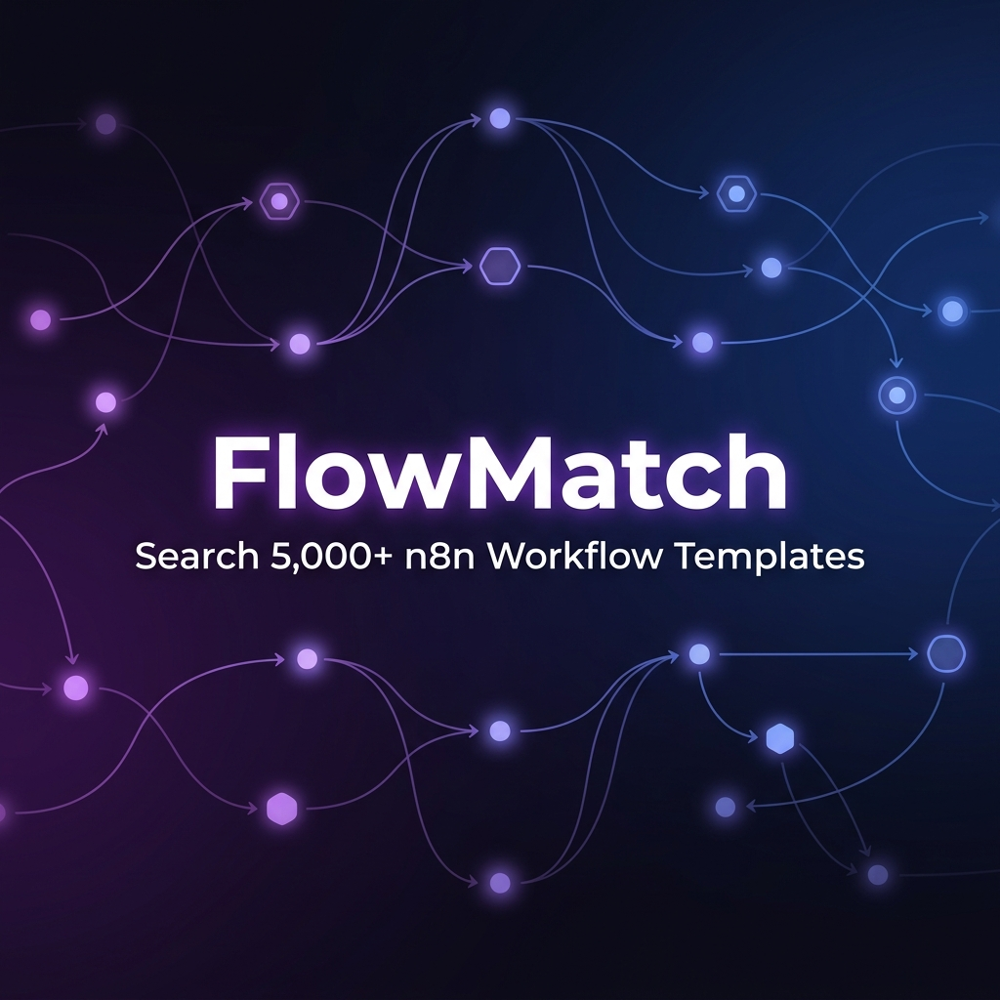

<div align="center">



<br />

# FlowMatch

**Find the perfect n8n workflow in seconds.**

Discover, search, compare and deploy from over 5,000 curated automation templates — powered by AI matching, security scanning, and quality analysis.

<br />

[](https://github.com/ganeshkrishnareddy/FlowMatch/stargazers)
[](https://github.com/ganeshkrishnareddy/FlowMatch/network)
[](https://github.com/ganeshkrishnareddy/FlowMatch/issues)
[](LICENSE)
[](https://react.dev)
[](https://typescriptlang.org)
[](https://vite.dev)
[](https://tailwindcss.com)
[](https://supabase.com)
[](https://pages.cloudflare.com)
[](https://n8n.io)

<br />

[](https://flowmatch.progvision.in/workflows)
[](https://flowmatch.progvision.in/integrations)
[](https://flowmatch.progvision.in/categories)
[](https://flowmatch.progvision.in/workflows)

<br />

[🌐 Live Demo](https://flowmatch.progvision.in) · [📖 Documentation](https://flowmatch.progvision.in/about) · [🐛 Report Bug](https://github.com/ganeshkrishnareddy/FlowMatch/issues) · [💡 Request Feature](https://github.com/ganeshkrishnareddy/FlowMatch/issues)

</div>

---

## 🌐 Live Demo

> **[flowmatch.progvision.in](https://flowmatch.progvision.in)**
>
> Try searching for workflows like *"Send Slack alerts from Gmail"* or *"Sync Shopify orders to Google Sheets"*

---

## About

FlowMatch is an open-source automation workflow search engine that indexes, curates, and serves over **5,000 production-ready n8n workflow templates**. It combines AI-powered matching, automated security scanning, quality scoring, and duplicate detection to help automation builders find the right workflow in seconds — not hours.

Every workflow is parsed, normalized, security-scanned, and enriched with human-readable setup instructions before it appears in the directory.

---

## Why FlowMatch?

| Problem | FlowMatch Solution |
|---|---|
| Searching through hundreds of workflows manually | **AI-powered natural language search** — describe what you need in plain English |
| No way to verify workflow quality before downloading | **Automated quality scoring** on structure, completeness, and configuration |
| Risk of importing workflows with exposed secrets | **Security scanning** detects credentials, suspicious commands, and common risks |
| Duplicate and near-identical templates clutter results | **Duplicate detection** keeps search results clean and unique |
| Workflow JSON files are hard to understand | **Auto-generated setup instructions** with step-by-step configuration guides |
| Can't preview workflow structure before importing | **Interactive node graph visualization** with animated connectors |

---

## How FlowMatch Compares

| Feature | FlowMatch | n8n Templates | Zapier | Make |
|---|:---:|:---:|:---:|:---:|
| AI-Powered Search | ✅ | ❌ | ❌ | ❌ |
| 5,000+ Workflows | ✅ | ✅ | ❌ | ❌ |
| Security Scanning | ✅ | ❌ | ❌ | ❌ |
| Quality Scoring | ✅ | ❌ | ❌ | ❌ |
| Duplicate Detection | ✅ | ❌ | ❌ | ❌ |
| Interactive Graph Preview | ✅ | ❌ | ❌ | ❌ |
| Auto Setup Instructions | ✅ | ❌ | ❌ | ❌ |
| One-Click JSON Export | ✅ | ✅ | ❌ | ❌ |
| 300+ Integration Filters | ✅ | ✅ | ✅ | ✅ |
| Open Source | ✅ | ✅ | ❌ | ❌ |
| Free | ✅ | ✅ | ❌ | ❌ |

---

## Features

| Category | Feature |
|---|---|
| 🔍 **Search** | Full-text search across 5,000+ workflows by name, description, integration, or category |
| 🤖 **AI Match** | Natural language query engine — describe what you need, get matched workflows |
| 📊 **Visualization** | Interactive node graph powered by React Flow with animated connectors |
| 🛡️ **Security** | Automated detection of exposed secrets, suspicious commands, and common risks |
| 🔄 **Deduplication** | Identifies identical and highly similar workflows to keep results clean |
| 📝 **Instructions** | Human-readable setup guides auto-generated for every workflow |
| 📦 **Export** | Download production-ready n8n JSON with embedded setup instructions as sticky notes |
| 🏷️ **Categories** | Browse workflows organized across 36 business domains and use cases |
| 🔌 **Integrations** | Filter by specific apps: Slack, Gmail, Notion, Shopify, HubSpot, OpenAI, and more |
| 📚 **Collections** | Hand-picked workflow bundles for common business scenarios |
| 🌓 **Themes** | Full dark and light mode support with dark mode as default |
| 📱 **Responsive** | Optimized for desktop, tablet, and mobile viewports |
| ⚡ **Performance** | Code-split lazy loading, optimized bundles under 500KB gzipped |
| 🧪 **Quality** | Every workflow scored on structure, completeness, and configuration quality |
| 🏗️ **Original** | 2,000+ FlowMatch-authored workflows alongside indexed community templates |

---

## Screenshots

<div align="center">

| Homepage (Dark) | AI Match |
|:---:|:---:|
|  |  |

| Workflow Explorer | Workflow Details |
|:---:|:---:|
|  |  |

| Categories | Integrations |
|:---:|:---:|
|  |  |

| Homepage (Light) | Alternatives Guide |
|:---:|:---:|
|  |  |

</div>

> 📸 *Screenshots will be added as the project evolves. Run `npm run dev` to preview locally.*

---

## Popular Categories

<table>
<tr>
<td align="center">🤖<br><b>AI Agents</b></td>
<td align="center">📧<br><b>Email</b></td>
<td align="center">💬<br><b>Slack</b></td>
<td align="center">🛒<br><b>E-Commerce</b></td>
<td align="center">📊<br><b>Analytics</b></td>
<td align="center">🔔<br><b>Notifications</b></td>
</tr>
<tr>
<td align="center">📱<br><b>WhatsApp</b></td>
<td align="center">✈️<br><b>Telegram</b></td>
<td align="center">🎮<br><b>Discord</b></td>
<td align="center">📋<br><b>CRM</b></td>
<td align="center">💰<br><b>Finance</b></td>
<td align="center">🏥<br><b>Healthcare</b></td>
</tr>
<tr>
<td align="center">📄<br><b>Documents</b></td>
<td align="center">🔧<br><b>DevOps</b></td>
<td align="center">📈<br><b>Marketing</b></td>
<td align="center">🎓<br><b>Education</b></td>
<td align="center">🏢<br><b>HR</b></td>
<td align="center">🔐<br><b>Security</b></td>
</tr>
</table>

[Browse all 36 categories →](https://flowmatch.progvision.in/categories)

---

## Architecture

```
┌─────────────────────────────────────────────────────────────┐
│                        Client (React)                       │
├──────────┬──────────┬──────────┬──────────┬────────────────┤
│  Search  │ AI Match │ Workflow │ Category │  Integration   │
│  Engine  │  Engine  │ Explorer │ Browser  │   Explorer     │
├──────────┴──────────┴──────────┴──────────┴────────────────┤
│                    Service Layer                            │
├──────────┬──────────┬──────────┬──────────┬────────────────┤
│ Workflow │ Security │ Quality  │ Category │  Instruction   │
│  Parser  │ Scanner  │  Scorer  │Normalizer│  Generator     │
├──────────┴──────────┴──────────┴──────────┴────────────────┤
│                  Data Repository Layer                      │
├─────────────────────────┬──────────────────────────────────┤
│   JSON Chunk Storage    │       Supabase (Postgres)        │
│  (5,000+ workflows)    │     (metadata + analytics)       │
└─────────────────────────┴──────────────────────────────────┘
```

---

## Platform Statistics

| Metric | Count |
|---|---|
| 📊 Total Workflows | **5,123** |
| 🔌 Integrations | **301** |
| 📁 Categories | **36** |
| ✅ Quality Checked | **3,376** |
| 🏗️ Original Templates | **2,000+** |
| 📥 Indexed Templates | **3,100+** |

---

## Tech Stack

| Layer | Technology |
|---|---|
| **Frontend** | React 19, TypeScript 5.8, Vite 8 |
| **Styling** | TailwindCSS 4, Custom design system |
| **State** | React hooks, lazy loading, code splitting |
| **Visualization** | React Flow (interactive workflow graphs) |
| **Backend** | Supabase (PostgreSQL + Auth + Storage) |
| **Data** | Chunked JSON with pre-built search indices |
| **AI** | OpenAI embeddings for semantic workflow matching |
| **Hosting** | Cloudflare Pages |

---

## Installation

### Prerequisites

- Node.js 18+
- npm 9+

### Setup

```bash
# Clone the repository
git clone https://github.com/ganeshkrishnareddy/FlowMatch.git

# Navigate to project directory
cd FlowMatch

# Install dependencies
npm install

# Start development server
npm run dev
```

The app will be available at `http://localhost:5173`.

### Production Build

```bash
# Build for production
npm run build

# Preview production build
npm run preview
```

### Environment Variables

Create a `.env` file based on `.env.example`:

```env
VITE_SUPABASE_URL=your_supabase_url
VITE_SUPABASE_ANON_KEY=your_supabase_anon_key
VITE_SITE_URL=https://flowmatch.progvision.in
```

---

## Project Structure

```
FlowMatch/
├── public/
│   └── data/
│       └── indexed-workflows/     # 5,000+ workflow JSON chunks
│           ├── chunks/            # Paginated workflow batches
│           ├── details/           # Individual workflow files
│           └── index.json         # Master index with categories & integrations
├── src/
│   ├── components/
│   │   ├── brand/                 # Platform logo SVGs
│   │   ├── common/                # Shared UI (SEOHead, AnimatedCounter)
│   │   ├── layout/                # Navbar, Footer, AppShell
│   │   └── workflow/              # WorkflowCard, WorkflowGraph, badges
│   ├── pages/                     # Route-level page components
│   ├── services/
│   │   ├── workflowParser.ts      # n8n JSON → structured data
│   │   ├── workflowNormalizer.ts  # Display name normalization
│   │   ├── securityScanner.ts     # Automated security checks
│   │   ├── workflowQualityScorer.ts # Quality score computation
│   │   ├── categoryNormalizer.ts  # Category classification
│   │   ├── instructionGenerator.ts # Setup guide generation
│   │   ├── stickyNoteInjector.ts  # n8n sticky note instructions
│   │   └── workflowGraphLayout.ts # Topological graph layout engine
│   ├── repositories/              # Data access layer
│   ├── types/                     # TypeScript type definitions
│   └── config/                    # App configuration
├── scripts/                       # Build & generation scripts
├── reports/                       # Quality & security reports
├── docs/                          # Documentation & assets
└── supabase/                      # Database migrations
```

---

## Workflow Processing Pipeline

Every workflow goes through a multi-stage pipeline before appearing in the directory:

```
Raw n8n JSON
    ↓
┌─────────────┐
│   Parser    │  Extract nodes, connections, metadata
└──────┬──────┘
       ↓
┌─────────────┐
│ Normalizer  │  Clean display titles, descriptions
└──────┬──────┘
       ↓
┌─────────────┐
│  Security   │  Scan for secrets, suspicious patterns
│   Scanner   │
└──────┬──────┘
       ↓
┌─────────────┐
│  Quality    │  Score structure, completeness, config
│   Scorer    │
└──────┬──────┘
       ↓
┌─────────────┐
│ Instruction │  Generate human-readable setup guides
│  Generator  │
└──────┬──────┘
       ↓
┌─────────────┐
│  Category   │  Classify into 36 business categories
│ Normalizer  │
└──────┬──────┘
       ↓
  Ready for Search
```

---

## FAQ

<details>
<summary><b>What is FlowMatch?</b></summary>
<br />
FlowMatch is an open-source search engine for n8n automation workflows. It indexes over 5,000 workflow templates and lets you search, compare, visualize, and download them — all for free.
</details>

<details>
<summary><b>Is FlowMatch free?</b></summary>
<br />
Yes. FlowMatch is completely free and open source under the MIT License. You can use, modify, and distribute it.
</details>

<details>
<summary><b>Do I need an AI API key to use FlowMatch?</b></summary>
<br />
No. The basic search, browsing, and download features work without any API key. The AI matching feature uses OpenAI embeddings and requires a key only if you want semantic search in a self-hosted setup.
</details>

<details>
<summary><b>Can I add my own workflows?</b></summary>
<br />
Yes. Use the admin import tool to upload your n8n JSON exports. Each workflow is automatically parsed, validated, security-scanned, and enriched with setup instructions.
</details>

<details>
<summary><b>How are duplicates detected?</b></summary>
<br />
FlowMatch uses structural comparison of workflow node types, connections, and configuration patterns to identify identical and near-identical templates, keeping search results clean.
</details>

<details>
<summary><b>Does FlowMatch work offline?</b></summary>
<br />
Yes. All 5,000+ workflows are bundled as static JSON files. Once loaded, the entire search and browsing experience works offline — no server required.
</details>

<details>
<summary><b>How many workflows are available?</b></summary>
<br />
FlowMatch currently indexes <b>5,123 workflows</b> across <b>36 categories</b> with <b>301+ integrations</b>. This includes 2,000+ original FlowMatch-authored templates.
</details>

<details>
<summary><b>What integrations are supported?</b></summary>
<br />
Over 301 integrations including Gmail, Slack, Notion, Google Sheets, Shopify, HubSpot, OpenAI, Discord, Telegram, Airtable, Stripe, WooCommerce, GitHub, and many more.
</details>

---

## Roadmap

- [x] 5,000+ curated workflows
- [x] AI-powered semantic matching
- [x] Automated security scanning
- [x] Quality scoring system
- [x] Duplicate detection
- [x] 36 business categories
- [x] 301+ integration filters
- [x] Interactive workflow visualization
- [x] Auto-generated setup instructions
- [x] Dark mode (default)
- [x] Responsive mobile design
- [x] n8n alternatives comparison guide
- [ ] AI Workflow Builder — generate custom workflows from descriptions
- [ ] Workflow Versioning — track template changes over time
- [ ] Community Collections — user-curated workflow bundles
- [ ] User Ratings & Reviews
- [ ] Workflow Comments & Discussions
- [ ] Public REST API
- [ ] Webhook testing sandbox
- [ ] Multi-platform export (Make, Zapier, Pipedream)

---

## Contributing

Contributions are welcome! Please read our [Contributing Guide](CONTRIBUTING.md) for details.

```bash
# Fork the repository
# Create your feature branch
git checkout -b feature/your-feature

# Commit your changes
git commit -m "Add your feature"

# Push to the branch
git push origin feature/your-feature

# Open a Pull Request
```

See also: [Code of Conduct](CODE_OF_CONDUCT.md) · [Security Policy](SECURITY.md)

---

## License

This project is licensed under the MIT License — see the [LICENSE](LICENSE) file for details.

---

## Acknowledgements

- [n8n](https://n8n.io) — The workflow automation platform
- [React Flow](https://reactflow.dev) — Interactive node graph library
- [Supabase](https://supabase.com) — Open-source Firebase alternative
- [Vite](https://vite.dev) — Next-generation frontend tooling
- [TailwindCSS](https://tailwindcss.com) — Utility-first CSS framework
- [Lucide](https://lucide.dev) — Icon library
- [Cloudflare Pages](https://pages.cloudflare.com) — Edge deployment platform

---

<div align="center">

## Support the Project

If FlowMatch saves you time or helps you build better automations, consider supporting the creator.

<br />

[](https://razorpay.me/@ProgVision)
[](https://github.com/sponsors/ganeshkrishnareddy)

<br />

Built with ❤️ by **[ProgVision](https://github.com/ganeshkrishnareddy)**

If this project helped you, consider giving it a ⭐

<br />

[](https://star-history.com/#ganeshkrishnareddy/FlowMatch&Date)

</div>
